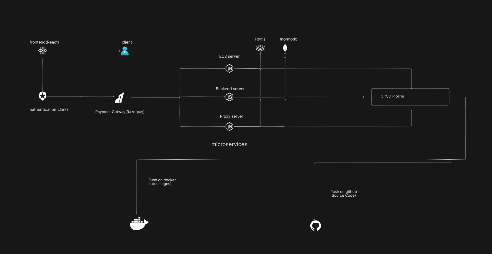

<h1>Hoststream</h1>


<br>

<h1>Hoststream's system design</h1>
<br>

<br>

<h2>system design url :</h2>
<a href="https://app.eraser.io/workspace/31q7M7OHoxmqHpeXrCHO">https://app.eraser.io/workspace/31q7M7OHoxmqHpeXrCHO</a>
<br>
<br>
<h1>Video</h1>
<br>
<video width="640" height="360" controls autoplay  poster="./frontend/src/assets/hoststream.ico">
  <source src="C:\Users\91888\Videos\Hoststream_demo.mp4" type="video/mp4">

</video>
<h1>installation</h1>
<br>
<h3>Linux</h3>

```
apt update -y
apt upgrade -y
apt install git -y
git clone https://github.com/Karan-Kumar-Mishra/Hoststream.git
cd Hoststream
chmod +x start.sh
bash start.sh

```

<h3>Windows</h3>

<p>1. Download the nodejs </p>
<p>2. Download the Git </p>

```
git clone https://github.com/Karan-Kumar-Mishra/Hoststream.git
cd Hoststream
cd backend
npm i && tsc
node dist/server.js
cd ..

cd Proxy-Server
npm i && tsc
node dist/server.js
cd ..

cd frontend
npm i && tsc
npm run build
npm i serve
serve -S dist

```

<h4>Dokcer </h4>

```
git clone https://github.com/Karan-Kumar-Mishra/Hoststream.git
cd Hoststream
docker-compose up

```
